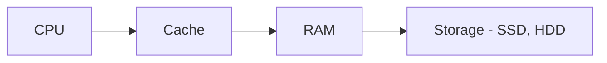

>[!imp] #### Data structures + Algorithms = Programs

Based on different scenarios, data needs to be stored in different formats. They are simply ways of storing data.

To understand data structures, you need to understand how data is stored and accessed in a computer system - 

1. Cache is the fastest but the smallest store of data a CPU can access, it is stored on the CPU itself and this is so blazing fast due to its proximity to the CPU
2. RAM is the second fastest being attached to the CPU in lanes. This is only temporary memory as the data is lost once the system loses power
3. Storage - The slowest but the most permanent form of memory

>[!info] &nbsp; Know-How of data structures 
>1. How to build one
>2. How to use it
>&nbsp;
>Simply having this knowledge will allow you to completely be able to switch languages while building data structures

### Types of Data Structures

- Arrays
- Stacks
- Queues
- Linked Lists
- Trees
- Tries
- Graphs
- Hash Tables

![[Pasted image 20231015192412.png]]

> [!hint] You can build your own Data-structures!
> ###### You need to know that data structures are simply different ways of storing data, they usually come pre-built with whatever language you might use but it is very important to note that you can create them on your own in your language from scratch if a particular data structure is not pre-built in your language

![[1 WuPrPNWDYL72boblf4Me4Q.webp]]
	Above is a supported list of data structures in particular languages