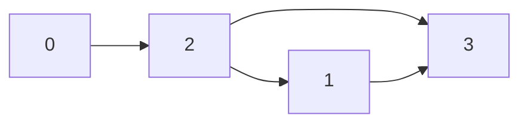

Graphs are data structures that consist of Nodes (vertices) and edges, they are used to model real-world relationships representing _links_. Ex. Friendships, family trees, networks, the internet, roads between cities etc.

![[Pasted image 20231112131822.png]]

>[!info]  Graphs can be of various types - 
> ![[Pasted image 20231112132058.png]]
> 
> These are all types of graphs. As you can see, graphs encompass a variety of data structures such as Trees, which in-turn encompass linked lists


### Types of graphs - 
###### 1. Directed v/s Undirected

![[Pasted image 20231112132827.png]]

###### 2. Weighted v/s Non-weighted

![[Pasted image 20231112132936.png]]

###### 3. Cyclic v/s Acyclic 

![[Pasted image 20231112133131.png]]


### Defining your graph - 

A graph can be given as an input in 3 ways 
1. Edge List
2. Adjacent List
3. Adjacent Matrix - Gives you the easy ability to add weights

For ex. consider the following graph: 



```python
# Edge List
graph = [[0,2], [2,1], [2,3], [1,3]]

# Adjacent List - The index 'i' of list describes it's connection with other nodes
graph = [[2], [2, 3], [0, 1, 3], [1, 2]]

# Adjacency Matrix - The value can represent a weight of an edge between two nodes
graph = [
		 [0, 0, 1, 0],
		 [0, 0, 1, 1],
		 [1, 1, 0, 1],
		 [0, 1, 1, 0]
]
```

![[Pasted image 20231112135051.png]]

#### Building a Graph (Undirected using adjacency list)
```python
class Graph:  
    def __init__(self):  
        self.numberOfNodes = 0  
        self.adjacencyMatrix = {}  
  
    def addVertex(self, node):  
        self.numberOfNodes += 1  
        self.adjacencyMatrix[node] = []  
  
    def addEdge(self, node1, node2):  
        self.adjacencyMatrix[node1] += [node2]  
        self.adjacencyMatrix[node2] += [node1]  
    def showConnections(self):  
        allNodes = list(self.adjacencyMatrix.keys())  
        for node in allNodes:  
            nodeConnections = self.adjacencyMatrix[node]  
            connections = ""  
            for vertex in nodeConnections:  
                connections += vertex + ", "  
            print(node, " --> ", connections)  
  
  
myGraph = Graph()  
myGraph.addVertex('0')  
myGraph.addVertex('1')  
myGraph.addVertex('2')  
myGraph.addVertex('3')  
myGraph.addVertex('4')  
myGraph.addVertex('5')  
myGraph.addVertex('6')  
myGraph.addEdge('3', '1')  
myGraph.addEdge('3', '4')  
myGraph.addEdge('4', '2')  
myGraph.addEdge('4', '5')  
myGraph.addEdge('1', '2')  
myGraph.addEdge('1', '0')  
myGraph.addEdge('0', '2')  
myGraph.addEdge('6', '5')  
  
myGraph.showConnections()
```

__OUTPUT__ - 
```
C:\Users\Abhijeet\AppData\Local\Programs\Python\Python312\python.exe D:\Classroom\Learnings\DSA_python\Graphs.py 
0  -->  1, 2, 
1  -->  3, 2, 0, 
2  -->  4, 1, 0, 
3  -->  1, 4, 
4  -->  3, 2, 5, 
5  -->  4, 6, 
6  -->  5, 
```

### Pros and Cons of graphs - 
- Graphs are the **BEST** for structures having relationships
- They are **NOT** optimal for scaling


For the 99% of the part you won't need to implement a graph yourself, instead you'll use pre-existing libraries and tools already available in the market for ex. _Neo4j_ is a very popular database tool that allows you to quickly store data in form of Graphs